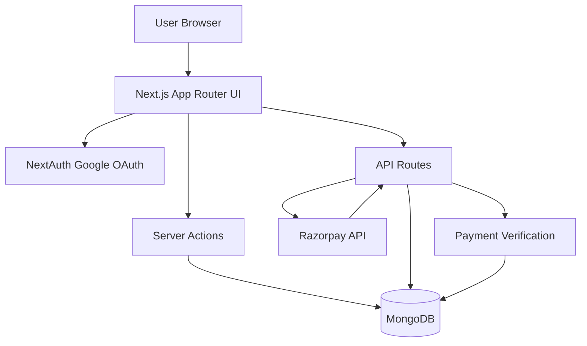

# Get Me A Chai

A Patreon-style creator support platform where fans can fund creators with one-time payments.

This project demonstrates end-to-end full-stack development with authentication, creator profile management, payment order creation, signature verification, and persistent transaction history.

## Why This Project

Get Me A Chai focuses on a real product workflow instead of a basic CRUD demo:

- Creator onboarding through Google OAuth.
- Creator profile management from a protected dashboard.
- Public creator pages with donation flow.
- Razorpay order creation and server-side signature verification.
- Supporter history and top contributors section.

## Tech Stack

- Framework: Next.js (App Router), React
- Auth: NextAuth (Google Provider)
- Database: MongoDB with Mongoose
- Payments: Razorpay
- UI: Tailwind CSS
- Notifications: React Toastify

## Core Features

- Google login and session-aware navigation.
- Protected dashboard for profile updates.
- Public username route for creator pages.
- Search creators by name and username.
- Create payment orders from the backend.
- Verify payment signature securely on the backend.
- Persist and display top payments.

## Architecture Overview



## Project Structure

```
app/
	api/
		auth/[...nextauth]/route.js   # NextAuth handlers
		order/route.js                # Razorpay order creation
		verify/route.js               # Signature verification
		search/route.js               # Creator search
	dashboard/page.js               # Protected creator dashboard
	[username]/page.js              # Public creator support page
actions/
	userActions.js                  # Server actions for users/payments
db/
	connectDB.js                    # MongoDB connection helper
models/
	User.js                         # Creator profile model
	Payment.js                      # Payment transaction model
lib/
	authOptions.js                  # NextAuth config/callbacks
```

## Local Setup

1. Install dependencies.

```bash
npm install
```

2. Create `.env.local` in project root and add required variables.

```env
MONGO_URI=your_mongodb_connection_string
GOOGLE_CLIENT_ID=your_google_client_id
GOOGLE_CLIENT_SECRET=your_google_client_secret
NEXTAUTH_SECRET=your_nextauth_secret
NEXTAUTH_URL=http://localhost:3000
```

3. Run the app.

```bash
npm run dev
```

4. Open http://localhost:3000

## Payment Flow

1. Supporter opens a creator page (`/[username]`).
2. Client sends amount and supporter details to `/api/order`.
3. Server validates payload, creates Razorpay order, stores pending payment.
4. Razorpay checkout completes on client.
5. Client sends payment details to `/api/verify`.
6. Server verifies HMAC signature and marks payment as paid/failed.

## Security Notes

- Server-side payment verification is implemented using HMAC SHA-256 and timing-safe comparison.
- Input validation exists for amount and required fields on payment creation.
- Route handlers avoid exposing sensitive internals in client responses.

## Known Limitations

- No automated test suite yet (unit/integration/e2e).
- No rate limiting on public payment/search endpoints.
- Razorpay secret handling can be improved further (encryption or secure vault approach).
- README does not yet include deployed demo link and screenshots.

## Resume-Ready Impact Bullets

Use these directly (or adapt) in your resume:

- Built a Patreon-style full-stack platform with Next.js, NextAuth, MongoDB, and Razorpay for creator funding workflows.
- Implemented secure payment lifecycle with backend order creation, HMAC signature verification, and transaction persistence.
- Developed protected creator dashboard and dynamic public profile routes with search, profile customization, and supporter leaderboard.

## Future Improvements

- Add test coverage (API route tests and payment flow integration tests).
- Add rate limiting and abuse protection for public APIs.
- Introduce payment webhooks and idempotency safeguards.
- Add observability (structured logs and error monitoring).
- Add deployment docs, screenshots, and live demo URL.

## Scripts

- `npm run dev`: Run local development server
- `npm run build`: Create production build
- `npm run start`: Start production server
- `npm run lint`: Run ESLint
